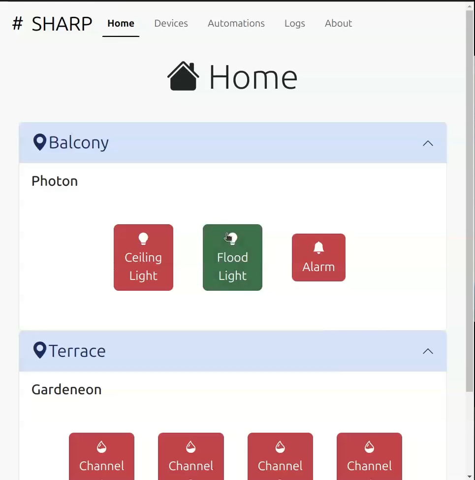

# # SHARP 
## Smart Home Automation Research Project



### Description:
SHARP is a Flask Application to control and automate smart home devices. 

### Video Demo:  
#### Watch demo here : https://drive.google.com/file/d/1fiYBWEgvNcOzQ9FvvY1tlHamog_6RHZZ/view?usp=sharing

### Salient Features
- Lightweight
- Supports MQTT devices
- Responsive-Design, adapts to mobile devices
- Time Based Automations available now
- Adding new automation logic is just a matter of adding a new python class
- Logs Feature allows to view both device activites and application logs
- Deployed in my local network on a Raspberry Pi using Gunicorn and Nginx

> Logs work only if SHARP is deployed as a systemd service.

### Installation and Deployment

- Clone this repo, create a virtual environment,
- Create a "data" directory with an empty "automations.json" and a "devices_info.json" with suitable details.
- Install gunicorn in the same virtual environment.
- Create a "config" directory and add "flask_app_conf.json" and "mqtt_conf.json", along with valid details as per ur situation.
- Create a systemd service, example :
```
[Unit]
Description=Smart Home Automation Research Project
After=multi-user.target

[Service]
WorkingDirectory=/home/uthayamurthy/SHARP
Environment=PYTHONUNBUFFERED=1
ExecStart=/home/uthayamurthy/SHARP/sharp_env/bin/gunicorn -c /home/uthayamurthy/SHARP/config/gunicorn_config.py app:app &
StandardOutput=journal
StandardError=journal

[Install]
WantedBy=multi-user.target
```
- Install Nginx, configure it according to your needs, example configuration :
```
server {
    listen 80;
    server_name <your ip>;
    access_log  /var/log/nginx/sharp.log;

    location / {
        proxy_pass http://127.0.0.1:8000;
        proxy_set_header Host $host;
        proxy_set_header X-Forwarded-For $proxy_add_x_forwarded_for;
    }

    location /socket.io {
        include proxy_params;
        proxy_http_version 1.1;
        proxy_buffering off;
        proxy_set_header Upgrade $http_upgrade;
        proxy_set_header Connection "Upgrade";
        proxy_pass http://127.0.0.1:8000/socket.io;
    }
  }
```
- Enjoy !